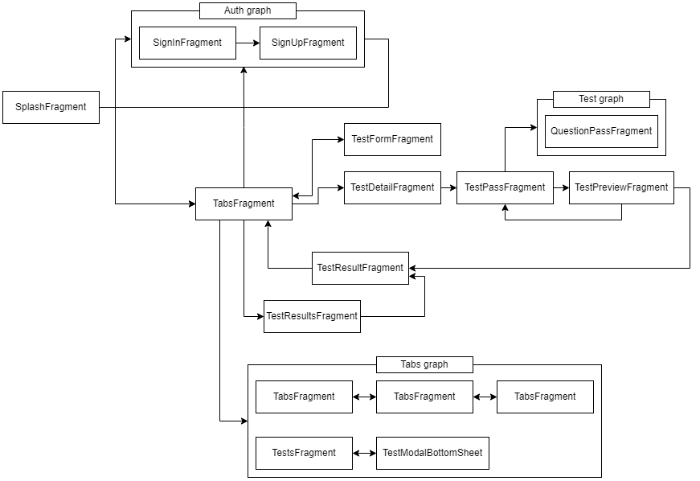
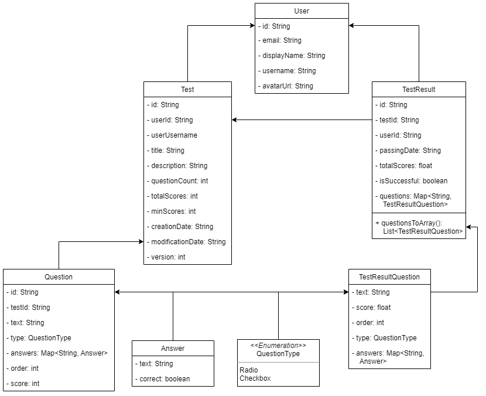

# Система тестирования
Приложение для создания и прохождения тестов. В приложении реализовано:
- Создание и редактирование учетной записи с добавлением картинки для аватара
- Создание, редактирование и прохождение тестов
- Вопросы теста могут быть двух форм: radio и checkbox
- В radio вопросе вариант ответа может быть только один, а в checkbox вопросах имеется возможность выбора нескольких вариантов ответа
- Вычисление баллов по прохождению тестов
- Хранение и просмотр результатов прохождения тестов

### Стек технологий
1. Для серверной части приложения был использован сервис облачных услуг Firebase, в частности, такие услуги как: 
	- Firebase Authorization для авторизации
	- Firebase Realtime database для хранение данных
	- Firebase Storage	для хранение картинок
2. Для навигации между фрагментами используется технология Navigation component
3. Для взаимодействия между UI и данными используется архитектура MVVM

### Граф фрагментов приложения

### Диаграмма классов моделей

### Видео, демонстирирующее создание и прохождение теста

